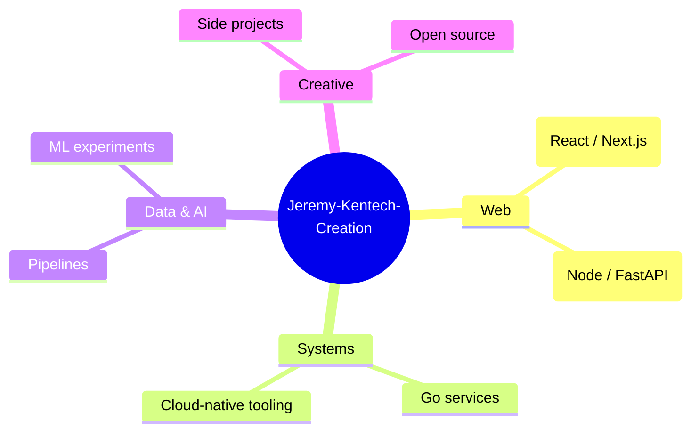

<!-- ───────────────────────────  HEADER  ─────────────────────────── -->
<div align="center">


[](https://git.io/typing-svg)

<br/>


</div>

<!-- ───────────────────────────  ABOUT  ─────────────────────────── -->

## 🌱 About Us

```ts
const team = {
  name: "Jeremy-Kentech-Creation",
  motto: "Build things that matter, work, and delight.",
  values: ["Craft", "Curiosity", "Collaboration"],
  workflow: ["idea", "prototype", "ship", "iterate"],
  alwaysLearning: true,
};
```

> _A creative team building software projects and exploring new ideas._
> Whether it's a tiny experiment or a long-term project — we believe in building things that **matter**, **work**, and **delight**.

<br/>

<!-- ───────────────────────────  MISSION  ─────────────────────────── -->

## 🎯 Our Focus



<br/>

<!-- ───────────────────────────  PROJECTS  ─────────────────────────── -->

## 🚀 Featured Projects

<div align="center">

<a href="https://github.com/Jeremy-Kentech-Creation">
  
</a>
<a href="https://github.com/Jeremy-Kentech-Creation">
  
</a>

</div>

| Project | Description | Status |
|---------|-------------|:------:|
| **Project A** | Short description goes here | 🟢 Active |
| **Project B** | Short description goes here | 🟡 In Progress |
| **Project C** | Short description goes here | 🔵 Planned |

> _Pin top repositories from the org page → **Customize your pins**._

<br/>

<!-- ───────────────────────────  TECH STACK  ─────────────────────────── -->

## 🛠️ Tech Stack

<div align="center">

**Languages**


**Frontend**


**Backend & Data**


**DevOps & Tools**


</div>

<br/>

<!-- ───────────────────────────  STATS  ─────────────────────────── -->

## 📊 Org Stats

<div align="center">


<br/><br/>


<br/><br/>


<br/><br/>


</div>

<br/>

<!-- ───────────────────────────  QUOTE  ─────────────────────────── -->

<div align="center">


</div>

<br/>

<!-- ───────────────────────────  CONTACT  ─────────────────────────── -->

## 🤝 Connect With Us

<div align="center">

[](mailto:your-email@example.com)
[](https://example.com)
[](https://github.com/Jeremy-Kentech-Creation)
[](#)
[](#)
[](#)

</div>

<br/>

<!-- ───────────────────────────  CTA  ─────────────────────────── -->

<div align="center">

### ✨ Want to build with us?

> Open an issue on any of our repos, or send us an email — we love meeting curious people.

</div>

<br/>

<!-- ───────────────────────────  FOOTER  ─────────────────────────── -->

<div align="center">


_Maintained with care by the **Jeremy-Kentech-Creation** team · © 2026_

</div>
